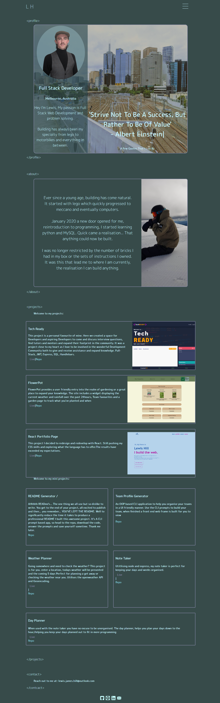

# Portfolio Page

## Licence

## Description

My motivation for this project was: To display what I have to offer to future employers and clients.

I built this project because To explore the creativity of CSS and javascript whilst increasing my online prescence.

This project solves the following problem the lack of online prescence.

From this project I learnt design is tough.

## Live Version

-   [here](https://lewy192.github.io/Updated-Portfolio-MK2/) is a link to the deployed site. Enjoy.

## Screenshot

## Contents

-   [Installation](#installation)
-   [Licence](#licence)
-   [Features](#features)
-   [Contributions](#contributions)
-   [Questions](#questions)

## Installation

To install this project n/a.

## Features

-   CSS animations.
-   Creative JavaScript.
-   Portfolio.

## Questions

-   Contact me via [GitHub](https://github.com/lewy192)
-   Contact me via [Email](mailto:lewis.james.hill@outlook.com)

## Acknowledgements

-   [w3schools](https://www.w3schools.com/)
-   [StackOverflow](https://stackoverflow.com/)

## acknowledgements

-   [Color Ratio](https://webaim.org/resources/contrastchecker/?fcolor=C5FFFD&bcolor=374B4A)
-   [Color Ratio MKII](https://webaim.org/resources/contrastchecker/?fcolor=FFE600&bcolor=374B4A)
-   [Color Filter](https://codepen.io/sosuke/pen/Pjoqqp)
-   [HTML escaping characters](https://stackoverflow.com/questions/7381974/which-characters-need-to-be-escaped-in-html)
-   [Translate Content on click](https://stackoverflow.com/questions/21919044/css3-transition-on-click-using-pure-css)
